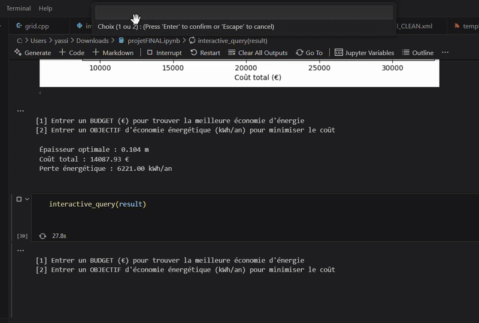
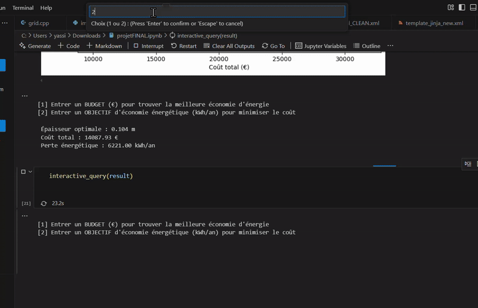

# Energy Renovation Optimization – Executive Summary

## Overview
This project explores how to optimize home energy renovations by balancing three key factors:
- Cost of renovation
- Energy savings
- Comfort and regulatory compliance

It combines housing models, official energy performance calculations (CSTB API), and optimization algorithms to identify the most effective renovation strategies.
**The API Key is Not Provided in the CODE for Copyright Reasons!**
## Approach
- Simulated a simplified dwelling and its energy losses  
- Tested renovation scenarios with CSTB’s certified energy calculation tool  
- Applied optimization methods (including a genetic algorithm) to find trade-offs between cost and performance  
- Produced visual Pareto fronts to guide decision-making  

## Key Outcomes
- An automated framework that evaluates renovation options  
- Clear visual results showing the best compromises between cost and energy savings  
- Interactive tool allowing selection based on either budget limits or energy-saving goals  

## Limitations
- CSTB API restrictions limited the number of scenarios tested, leading to less refined results  
- Further work is needed to cover windows, HVAC, and economic factors like subsidies and payback times  

## Next Steps
- Broaden the model to include more renovation options  
- Integrate financial parameters for realistic investment analysis  
- Develop a user-friendly interface  
- Explore applications at building and district scales
# Demonstration

### Example 1– Interactive Query by Budget

### Example 2 – Interactive Query by Energy Target

## Authors
- **Yassine Kouas**  
- **Merlin Condé Chérubin**  
- **Pierre Gineste**  

Supervised by **Lionel du Peloux**
